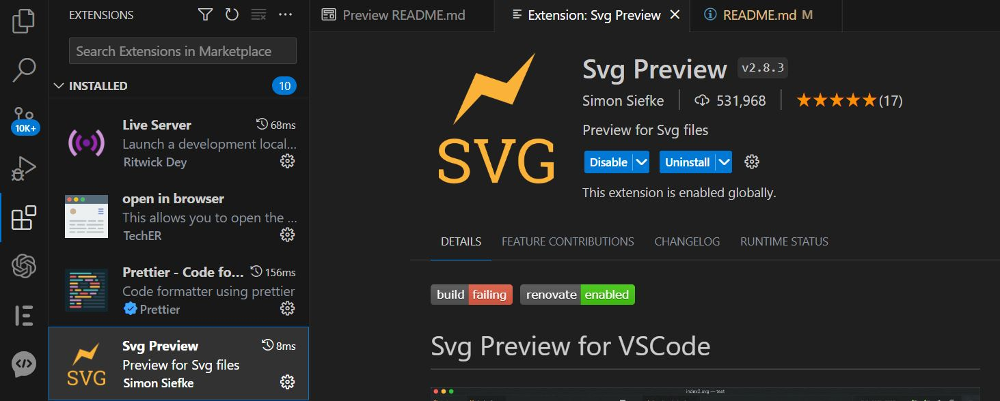

# Logo Maker

[](https://opensource.org/licenses/MIT)

## Description

This application will allow you to create simple logo for your clients and projects so that they can forego paying a graphic designer. It utilizes inquirer to prompt the user within the command line for how they would like their logo to look like. 

## Technologies Used

This project is powered by Node.js v16, utilizes inquirer v8.2.4 (node package manager), and file system module (node package manager). It also employs jest v29.5.0 (node package manager) for the unit testing conducted in this application. 

## Installation

1. Click on the file to open it in the terminal.

2. Run the command **npm i** to install the dependencies associated with this application (developers may need to install inquirer and jest directly from the command line, to do so the command for inquirer will be npm i inquirer@8.2.4 to install v8.2.4 of the inquirer, and npm i jest to install the latest version of jest).

3. To run the application, within the terminal, type the command **node index.js**.


```bash
Please see recording below these steps are followed:
```
[R e c o r d i n g](https://drive.google.com/file/d/1xkf7BeX06gSZ9IreuWzmipgFcn0GFZxu/view)


**NOTE** Once the application finished, the logo will be created **BUT** keep in mind that it will only be visible as an image whith the extension **Svg Preview** installed.




## License

NOTICE: This application is covered under the MIT License

## Questions

Have additional questions? Click the links below to reach me through my GitHub account or Email address.

[Link to Github](https://github.com/alexislendechy)

[Email](alexislendechy@gmail.com)
